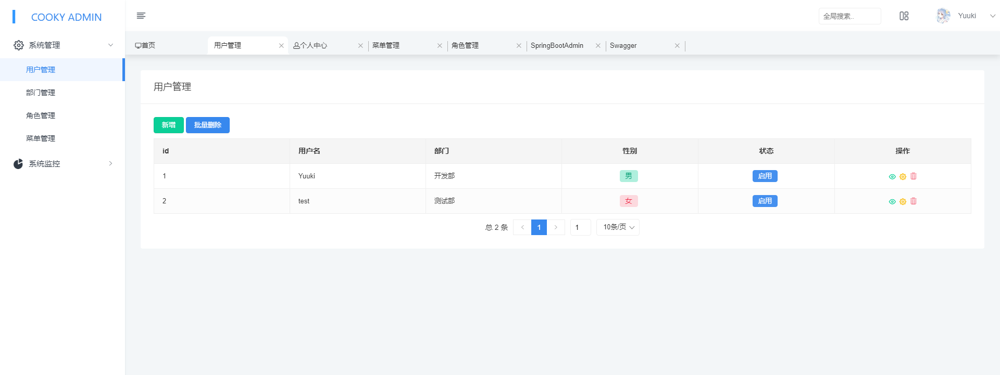
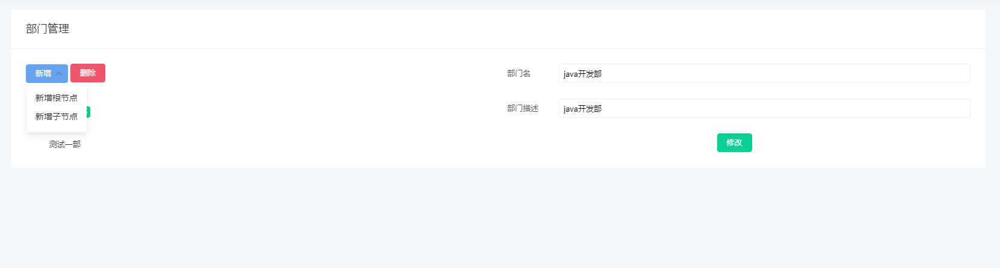
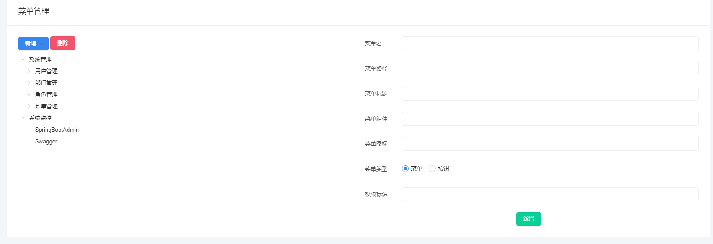
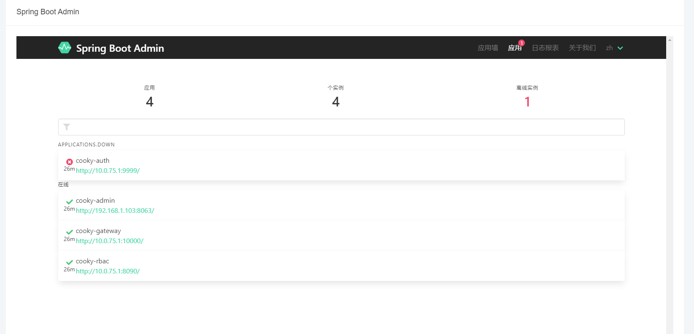
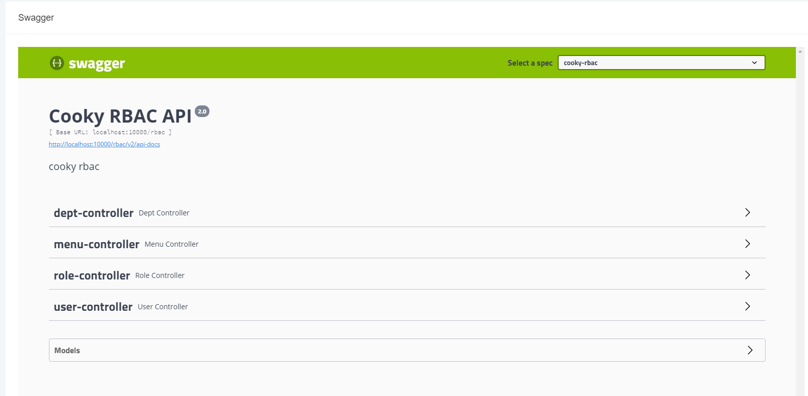

### COOKY CLOUD
基于nacos的spring cloud项目- - 
代码99.9999999999999999%摘抄 [FEBS CLOUD](https://github.com/wuyouzhuguli/FEBS-Cloud) 感谢帅逼鸟哥的贡献！
#### 功能清单（待定）
- [x] 权限管理
- [X] Spring boot Admin
- [X] skywalking
- [X] 音乐搜索接口
- [ ] 整合sentinel
- [ ] 本地音乐（fastdfs）
- [ ] 参数校验（前后端）
- [X] swagger

#### 演示地址
[地址](http://212.64.71.11) 账号密码就写在上面了登录就行，别瞎鸡儿改看看就行了谢谢！！！skywalking服务器太渣部署不上去，所以看不了！

#### 使用前准备
1. IDE安装 **lombok** 插件！！！
2. 下载nacos，并且导入数据
#### 使用指南
1. 导入sql文件
2. 导入项目
3. 修改启动参数，指定nacos.url等参数（具体看nacos中的配置，可自行修改）
4. 启动即可
5. 导入前端[（地址）](https://github.com/yuuki80code/cooky-cloud-web)
6. 安装依赖启动即可
#### 账号密码

账号|密码|备注
---|---|---
yuuki|123456|超级管理员
test|123456|测试（只有查看的权限）

#### 交流
帅逼也在~运行有问题加群找我~没问题也可以加群啊！一起吹牛逼！

#### 部分截图

